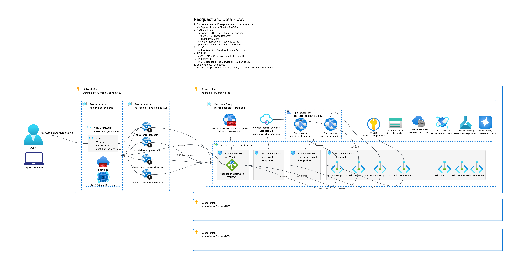

# Secure Azure Platform for an Internal AI Application

## Solution Overview

This repository presents a lightweight design for a secure internal employee AI application on Azure.

Application Gateway WAF_v2 provides the private application entry point, API Management (APIM) provides API governance, and separate Azure App Services host the frontend and backend API. Storage, Cosmos DB, Key Vault, Azure Container Registry (ACR), Azure AI Foundry and Azure Machine Learning are accessed through Private Endpoints wherever supported.

The platform uses Terraform and GitHub Actions with OIDC workload identity federation. Managed Identities and least-privilege access replace long-lived Azure credentials wherever possible. The design focuses on the workload spokes and consumes the organisation's existing Azure Landing Zone capabilities.

## Assumptions

- An Azure Landing Zone and Microsoft Entra ID already exist.
- The organisation uses hub-and-spoke VNets connected through VNet peering.
- Corporate users reach Azure through existing private connectivity such as ExpressRoute or site-to-site VPN.
- Private DNS Zones are centrally managed in the connectivity subscription and linked to the workload spoke VNets.
- Existing Azure Policy and monitoring capabilities provide the organisation-wide governance and diagnostic baseline.
- The frontend and backend applications are packaged as container images and stored in ACR.

## 1. High-Level Architecture



The platform is internal and private-by-default. Application Gateway provides WAF inspection and Layer 7 routing. APIM applies API policies before requests reach the backend. The frontend and backend use separate App Services so that they can have different identities, access permissions and deployment lifecycles.

### Main Traffic Flows

| Flow | Path | Purpose |
|---|---|---|
| UI traffic | Employee → Corporate DNS/network → Application Gateway → Frontend App Service | Provides private access to the employee web application. |
| API traffic | Employee/Frontend → Application Gateway → APIM → Backend App Service | Applies WAF inspection, routing and API governance before requests reach the backend. |
| Backend access | Backend App Service → VNet Integration → Private Endpoints → Data and AI services | Keeps workload data-plane traffic on private paths. |
| Deployment | GitHub Actions → OIDC → Azure control plane; private-networked runner → ACR and internal endpoints where required | Provides secretless infrastructure and application deployment. |

Application Gateway uses path-based routing:

- `/` and UI routes go to the Frontend App Service Private Endpoint.
- `/api/*` goes to the APIM Gateway Private Endpoint.
- APIM uses outbound VNet Integration to reach the Backend App Service Private Endpoint.
- The Backend App Service uses VNet Integration for approved outbound access to private data and AI services.

## 2. Networking Design

Each environment uses a spoke VNet connected to the existing enterprise hub. Address ranges are allocated through the Landing Zone/IPAM process.

### Network Segmentation

| Subnet | Purpose | Key configuration |
|---|---|---|
| Application Gateway subnet | Hosts Application Gateway WAF_v2 | Dedicated subnet, private frontend IP and NSG controls. |
| APIM integration subnet | Provides APIM outbound access to the private backend | Dedicated subnet for APIM Standard v2 VNet Integration. |
| App Service integration subnet | Provides App Service outbound access to private ACR and approved data/AI dependencies | Delegated to `Microsoft.Web/serverFarms`; NSG controls approved outbound paths. |
| Private Endpoint subnet | Hosts Private Endpoint NICs for APIM, App Services and Azure PaaS/AI services | Central workload PE subnet. Private Endpoint network policies can be enabled where additional NSG/UDR enforcement is required. |

APIM Standard v2 combines an inbound Gateway Private Endpoint with outbound VNet Integration. App Service Private Endpoints provide inbound connectivity, while App Service VNet Integration provides outbound connectivity.

### Traffic Controls

NSGs and subnet separation restrict traffic to the application paths and platform dependencies required by the design:

- Corporate users reach the Application Gateway private frontend through the existing hub connectivity.
- Application Gateway reaches the Frontend App Service and APIM through their Private Endpoints.
- APIM reaches the Backend App Service through VNet Integration and the Backend App Service Private Endpoint.
- The Backend App Service reaches ACR and approved data/AI services through VNet Integration and Private Endpoints.

Network reachability and authorization are both required. A Private Endpoint does not authorize a caller, and a Managed Identity role does not bypass DNS, routing or NSG controls.

### Private DNS

Private DNS is used to support Private Endpoint connectivity for the workload services.

Private DNS Zones are centrally managed and linked to the workload VNets where required. When a Private Endpoint is created, the corresponding service DNS record is associated with the appropriate privatelink zone.

Applications continue to use the standard Azure service FQDNs. DNS resolution maps those names to the Private Endpoint IP addresses, so traffic reaches services such as App Service, Storage, Key Vault, Cosmos DB and ACR over private network paths.

For the internal application entry point, ai.slatergordon.com resolves to the private frontend IP of Application Gateway.

### Ingress and Egress

The application has no intended direct public entry point. Corporate traffic enters through the private Application Gateway frontend. Public network access is disabled or restricted on supported workload services after private DNS and connectivity are validated.

Data and AI dependencies use Private Endpoints wherever supported. Any required Internet-bound traffic follows the existing controlled path:

`Workload Spoke → Hub → Azure Firewall → Approved External Destinations`

## 3. Identity and Security

Managed Identity is used for Azure workloads, while GitHub Actions authenticates through OIDC workload identity federation. Permissions are scoped to the smallest practical resource, container, database or project.

| Identity | Used by | Required access |
|---|---|---|
| Frontend App Service Managed Identity | Frontend App Service | ACR pull access for the frontend image only. No direct data-service access. |
| Backend App Service Managed Identity | Backend App Service | Backend ACR pull; least-privilege Storage and Cosmos DB data access; Key Vault access only where required; minimum Azure AI Foundry and Azure ML invocation permissions. |
| Application Gateway Managed Identity | Application Gateway | `Key Vault Secrets User` only when retrieving the HTTPS listener certificate from Key Vault. |
| APIM Managed Identity | API Management | Backend API application permission, for example `BackendApi.Invoke`. No direct downstream data-service access. |
| Terraform plan identity | GitHub Actions/OIDC | Read access to the target environment and access to the Terraform state backend. |
| Terraform apply identity | GitHub Actions/OIDC | `Contributor` on the target environment plus narrowly scoped RBAC administration where Terraform creates role assignments. |
| Application release identity | GitHub Actions/OIDC | ACR push access and deployment access to the target App Services. |

Employee Entra SSO and APIM-to-Backend application authentication are target Production controls, but they are not claimed as fully implemented by this lightweight infrastructure scaffold.

Security is implemented as defence in depth:

- **Application edge:** Application Gateway WAF_v2 inspects inbound HTTP/S traffic, while APIM applies API controls such as authentication/authorization policies, rate limits, request limits and controlled logging.
- **Network:** Private frontend IPs, Private Endpoints, NSGs and the hub firewall minimise public exposure and lateral connectivity.
- **Identity:** Managed Identities and least-privilege access control protect service-to-service access independently of the network path.
- **Secrets:** Key Vault stores only credentials and certificates that cannot be eliminated. ACR admin credentials are disabled.
- **Governance:** Existing Landing Zone policies provide the baseline. Workload-specific controls audit or restrict public network access, Private Link posture and diagnostic settings where appropriate. New controls would normally be validated in Audit mode before stronger enforcement is enabled.
- **Monitoring and data protection:** Diagnostic telemetry is sent to the existing central monitoring platform. Sensitive prompt or legal content is not logged by default.
- **Software supply chain:** CI/CD scans application images and deploys immutable commit tags or digests rather than `latest`.

## 4. Terraform Design

Terraform uses reusable service modules with thin environment compositions. Resource definitions remain in `modules`; environment folders contain environment-specific values, provider configuration and module wiring.

```text
terraform/
├── modules/
│   ├── network/
│   ├── app-service/
│   ├── api-management/
│   └── private-endpoint/
└── environments/
    ├── dev/
    ├── uat/
    └── prod/
```

Each environment has separate Terraform state, configuration and deployment identity. Provider configuration remains at the environment layer so that workload and shared connectivity subscriptions are addressed explicitly.

Terraform manages workload resources and RBAC assignments, while access to centrally managed Private DNS is granted only where required.

The repository provides four representative modules; Application Gateway, data, AI and other service modules would follow the same `main.tf`, `variables.tf`, `outputs.tf` contract. They are intentionally omitted rather than attempting to rebuild the Azure Landing Zone or implement every Production setting.

## 5. GitHub Actions CI/CD

GitHub Actions uses OIDC federation, so no long-lived Azure client secret is stored in GitHub.

The repository includes representative [infrastructure](.github/workflows/infrastructure.yml) and [application release](.github/workflows/application-release.yml) workflows. Their required GitHub Environments, variables and private-runner contract are documented in the [workflow notes](.github/workflows/README.md).

Standard GitHub-hosted runners can perform checkout, unit tests, linting and Terraform formatting/validation when no private endpoint access is required. Jobs that must reach private-only data-plane endpoints use a runner with Azure private network connectivity. This design uses an ephemeral self-hosted runner connected to an approved Azure subnet; GitHub-hosted runners with Azure private networking are also a valid enterprise alternative.

### Infrastructure Pipeline

```text
Pull Request
→ terraform fmt / validate
→ security checks

Selected environment
→ GitHub OIDC with plan identity
→ terraform plan

Approved environment
→ GitHub OIDC with apply identity
→ final plan and terraform apply
```

- Plan and apply use separate federated identities.
- UAT and Production use GitHub Environment approvals.
- State and deployment permissions are separated by environment.
- Terraform apply uses environment-scoped infrastructure permissions plus narrowly scoped RBAC administration where Terraform creates role assignments.

### Application Release Pipeline

```text
Build → Unit Test → Image Scan → Push immutable image to ACR
→ Update App Service image reference → Private smoke test
```

Build and unit tests can use a standard GitHub-hosted runner. ACR push and internal smoke tests use the private-networked runner.

Updating the App Service image reference uses the Azure control plane. The App Services then authenticate to ACR with their Managed Identities and pull the images through VNet Integration and the ACR Private Endpoint.

## 6. Key Design Trade-offs

### APIM Standard v2 vs Premium v2

Standard v2 is selected because its inbound Private Endpoint and outbound VNet Integration meet the current requirements at lower cost.

The trade-off is a more complex networking model. Premium v2 provides a more fully integrated VNet model, but at higher cost.

### Private Deployment Runner

GitHub-hosted runners with Azure private networking are the preferred option because they can access private ACR and internal endpoints with less runner-management overhead.

The trade-off is less infrastructure control and dependency on the organisation's GitHub plan and platform standards. Self-hosted runners provide more control but require more maintenance.

The final choice would depend on the organisation’s GitHub plan, security policy, cost and platform standards.

### Environment Isolation vs Cost

Development, UAT and Production use separate workload resources, identities and data.

This reduces blast radius and provides a stronger Production boundary, but increases resource duplication and cost.

## 7. Known Risks and Limitations

Key Considerations Before Production:

- Validate private DNS and end-to-end private connectivity.
- Confirm that the required AI models, regions and quota are available.
- Finalise employee sign-in and APIM-to-Backend authentication.
- The repository provides representative Terraform modules and CI/CD workflows rather than a complete Production implementation.

The design intentionally documents these dependencies rather than claiming unsupported Production completeness.
